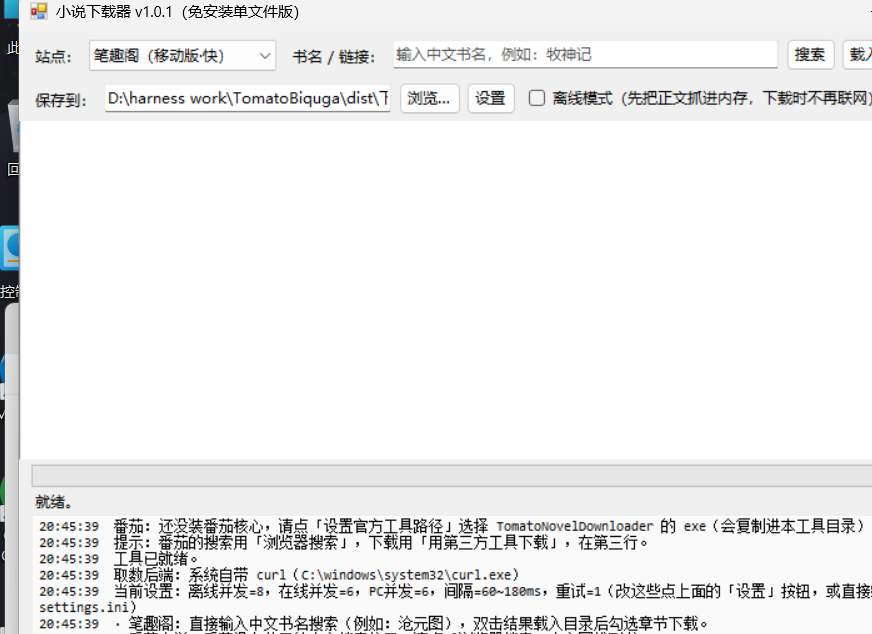

# 小说下载器（免安装单文件 exe）

**中文书名搜索 → 勾选章节 → 导出 UTF-8 TXT。** 一个 Windows 图形界面小工具，
编译出来只有一个 exe，**不需要 Node.js、不需要 Python、不需要装任何运行时**
（Windows 10 1903+ / 11 自带 .NET Framework 4.8）。

```
搜索「牧神记」→ 双击结果 → 等目录（首次约 10 分钟）→ 勾章节 → 导出
输出：D:\...\下载\牧神记（牧神纪）\牧神记（牧神纪）.txt   ← UTF-8 带 BOM
```



> **只做「解析公开可访问的网页 + 导出本地 TXT」**：不破解 DRM、不绕过登录或付费墙、
> 不内置任何正文数据源、不托管任何小说内容。下载内容版权归原作者与发布站点，
> **仅供个人离线阅读，请勿传播、勿商用**。详见文末「免责声明」。

---

## 一、快速开始

**下载**：[最新版 Release](https://github.com/George01230123/biquga-downloader/releases/latest)
（`novel-downloader-v1.1.1-win64.zip`，约 100 KB —— 程序本体 + 启动器 + 文档）

> 另有一个 `...-selftest.zip`：多带了 `_offlinetests.exe` / `_e2e.exe` / `_liveprobe.exe` / `_selftest.exe`
> 四个自测程序，**不需要它们也能正常下载**，只是下载出问题时用来定位。
> 提 issue 时把前两个的输出贴上来就够我判断了（前两个不联网）。

> **打不开 github.com？**（国内网络常见，本项目开发期间实测断过两次）
> `api.github.com` 通常还是通的，粘这段到 PowerShell 就能下（不用改任何东西）：
>
> ```powershell
> $base = 'https://api.github.com/repos/George01230123/biquga-downloader'
> $rel  = Invoke-RestMethod "$base/releases/latest" -Headers @{ 'User-Agent' = 'ps' }
> Invoke-WebRequest $rel.assets[0].url `
>   -Headers @{ 'User-Agent' = 'ps'; 'Accept' = 'application/octet-stream' } `
>   -OutFile "$env:USERPROFILE\Downloads\novel-downloader.zip"
> ```
>
> 注意：**别把 api 链接直接粘进浏览器地址栏** —— 那个接口默认返回一段 JSON 元信息，
> 不是文件（要带 `Accept: application/octet-stream` 才给文件本体）。
> 更多方式与排查见 [`docs/下载与网络问题.md`](docs/下载与网络问题.md)。

1. 解压到任意目录（别放 `C:\Program Files`，那里没有写权限）
2. 双击 **`start.bat`**（它会转交给 `start.ps1`；也可以直接双击 exe）
3. 站点选 **笔趣阁（移动版·快）**，输入中文书名，例如 `牧神记`
4. 点 **搜索** → 在结果里**双击**目标书（或选中后点「载入目录」）
5. 等目录载入（会弹窗问你「现在要下载全部 N 章吗？」）
6. 想先挑章节就点「否」，勾选后点 **下载选中章节**
7. 完成后弹窗会给出**完整文件路径**，「打开保存目录」可以直接跳过去

| 按钮 | 作用 |
| --- | --- |
| 搜索 | 笔趣阁用中文书名搜；番茄用「浏览器搜索」拿到链接后粘回来 |
| 浏览器搜索 | **番茄专用**：用默认浏览器打开番茄官网搜索页（番茄没有公开的中文搜索接口） |
| 载入目录 | 优先用本地缓存，缓存超过 72 小时会重新遍历 |
| 刷新目录 | 忽略缓存，强制重新遍历站点（拿最新章节时用） |
| ☑ 离线模式 | 载入目录时把正文一起抓下来，之后下载**不再联网**（强烈建议勾上） |
| 下载全部 / 下载选中 | 每 20 章落一次盘，可随时取消 |
| **更新新章节** | 站点更新了只下新章节（老正文一字不动）|
| **导出 EPUB** | 把已下载的正文导出成 EPUB，手机阅读器直接打开（不联网，**自动带封面**） |
| **导出 Markdown** | 导出带 YAML 头 + 目录锚点的 md（pandoc / 笔记软件 / 静态站点都能用） |
| **补齐缺章** | 只重抓缺失/空掉的那几章，按顺序插回正确位置（老正文不动） |
| **书架** | 下载过的书自动记进 `书架.json`，点一下就能**一键追更**，不用重新搜书名 |
| **任务队列** | 每行一本，依次下载。单本失败不影响后面的书，适合睡前挂机 |
| **检查更新** | 问 GitHub 有没有新版本（**只提示，不自动替换自己**） |
| ☑ 输出繁体 | 导出时把正文转成繁体（港台阅读器用，本地转换不联网） |
| 打开保存目录 | 直接打开保存文件夹 |
| 设置 | 并发线程数、请求间隔、失败自动重试轮数（存成 `settings.ini`，也可手改） |
| `站点配置.ini` | 每个站点单独的并发/间隔/超时/重试/UA/**代理/Cookie**/输出编码（**只含连接参数，不含提取规则**） |
| 设置核心 | 指定第三方番茄下载器的 exe（可选，见下）—— 只在「番茄小说」站点下出现 |

保存结构与缓存：

```
下载\
└── 牧神记（牧神纪）\
    ├── 牧神记（牧神纪）.txt          ← 正文，UTF-8 带 BOM
    ├── 封面.jpg                     ← 详情页的封面（导出 EPUB 时用它，不联网）
    ├── 牧神记（牧神纪）.epub         ← 点「导出 EPUB」后生成（含封面）
    └── 牧神记（牧神纪）.缺失章节.txt  ← 只有真的缺章时才生成，写明缺哪几章、为什么、地址
书架.json                              ← 下载过的书记录（书架一键追更用，可手改）
cache\                                 ← 目录缓存（每本一个 json），删掉即等于清空缓存
```

### 网络健壮性（被站点限流时会发生什么）

站点限流不一定会给状态码 —— 有的站**返回 200 但正文被换成「访问太频繁了…」**，
有的站"下太快正文变空"。所以程序同时认三样东西：

- **状态码**：429 / 503 / 403 → 判为限流
- **正文特征**：短文本里出现「访问太频繁」「请稍后重试」等 → 判为限流（**长正文一律不匹配**，不会误伤小说内容）
- **应对**：指数退避（限流时从 2 秒起步，封顶 20 秒，带抖动）+ **自动降并发**（每命中 2 次限流减 1 线程，最低 1）

被限速了也可以手动治：把 `站点配置.ini` 里该站点的 `workers` 调小、`mindelayms`/`maxdelayms` 调大。
需要代理或 Cookie 也在这个文件里配（支持 `http`/`https`/`socks5` 代理）。

细节见 [`docs/网络健壮性与书架.md`](docs/网络健壮性与书架.md)。

---

## 二、它解决的具体问题（也是我为什么写它）

| 问题 | 常见做法 | 这个工具的做法 |
| --- | --- | --- |
| 目录页是坏的 | 顺着“下一章”链接爬 | 移动版目录页完好：**11 次并发请求拿全 1067 章，1.48 秒** |
| 站点慢 | 一章一章串行抓 | 8 线程并发预抓正文 + 增量落盘 |
| 一断网全白干 | 内存里攒着最后一次性写 | 每 20 章 append 落盘，中途关掉也有半个文件 |
| 正文混广告 | 整行过滤（会连正文一起丢） | 按标记**切行尾**广告，保留句子本身 |
| 缺章了不知道缺哪章 | 只报一个总数 | 生成 `.缺失章节.txt`：章节号、原因、可复查的地址 |
| 依赖一堆东西 | pip / npm / 运行时 | 零依赖，系统自带编译器就能编 |

**实测数据**（都是真跑出来的，不是估算）：

| 书 | 章节 | 耗时 | 输出 |
| --- | --- | --- | --- |
| 牧神记（牧神纪） | 1067 章 | 578 秒 | 9.98 MB |
| 全职高手 | 1763 章 | 927 秒 | 15.52 MB |
| 超神宠兽店 | 1421 章 | — | 14.05 MB |
| 神级高手在都市 | 2308 章 | 1441 秒 | 17.59 MB，结尾是「（全文完）」 |
| 牧神记 EPUB 导出 | 1026 章 | — | 源 txt 10.4 MB → **EPUB 5.34 MB** |

其它实测：移动版目录页 11 页 / 1067 章 / **1.48 秒**；目录命中缓存 **0.1 秒**；
PC 版串行遍历同一本书要 **约 2 小时**（所以默认推荐移动版）。

---

## 三、为什么番茄要用别的工具（可选功能）

番茄小说（fanqienovel.com）的网页版正文有**风控 + 形近字替换保护**
（`在→茌`、`特→恃`、`只→黒`），连续请求还会返回验证码中间页甚至只给 200 字试读，
**网页抓取拿不到干净正文**。所以本工具的做法是：

- **笔趣阁** → 用本工具的搜索 / 目录 / 下载（这是主场，正文完整、广告残留 0）
- **番茄** → 如果你已经有第三方番茄下载器（如 `TomatoNovelDownloader`），
  点「设置/安装番茄核心」指定它的 exe，工具会调它的本地 API（`127.0.0.1:18423`）下载，
  自动启动服务、轮询进度、下完自动关掉。**没有它也不影响笔趣阁的全部功能。**
- 本仓库**不包含**任何第三方二进制（`fanqie-core/` 已在 `.gitignore` 里）。

---

## 四、自己编译（不需要 Visual Studio）

**方式 A：零依赖（推荐，用的是 Windows 自带的编译器）**

```bat
build.bat
```

它调用 `C:\Windows\Microsoft.NET\Framework64\v4.0.30319\csc.exe`，产出 `dist\` 下的：

| 产物 | 说明 |
| --- | --- |
| `小说下载器.exe` | 图形界面主程序（单文件，免安装） |
| `_selftest.exe` | 命令行自测：`_selftest.exe dl /69_69707 6`、`biquga`、`fanqie`、`write` |
| `_edgetest.exe` | 边界测试（含离屏真下载：把窗口移到屏幕外，跑一遍和界面完全相同的下载路径） |
| `_layoutprobe.exe` | 界面布局体检：越界/重叠逐条报出来，`--shots` 还能出截图 |
| `_offlinetests.exe` | **720 项离线单测，不联网**（CI 跑的就是它） |
| `_e2e.exe` | **端到端集成校验，不联网**：造一整本书（分卷 + 封面 + 繁体）→ 导出 EPUB/Markdown → 把产物当外来文件重新打开验（mimetype 顺序、每个 XML 用 `XmlDocument` 真解析、封面字节在位、目录嵌套精确计数） |
| `_liveprobe.exe` | **联网实测探针**（需要网络，不进离线门禁）：`cover` / `fanqie` / `export` 三个模式，验证真实站点的字段名、防盗链、以及"请求真的发出去了" |

`build.bat` 第一步会跑 `build\fix-encoding.ps1`：自动把源码补成 UTF-8 带 BOM，
并拒绝任何含中文的 `.bat`（这个坑踩过三次，见第六节）。

**方式 B：有 .NET SDK 时**

```bash
dotnet build build/NovelDownloader.csproj -c Release
dotnet build build/NovelDownloader.Tests.csproj -c Release
./dist/_offlinetests.exe        # 退出码 0 = 全部通过
```

CI（`.github/workflows/ci.yml`）走的就是方式 B，离线单测失败会直接红。

---

## 五、源码结构

```
src/                 界面与入口
  Program.cs         入口（含高分屏适配）
  MainForm.cs        图形界面：搜索 / 目录 / 勾选 / 下载 / 设置
  AssemblyInfo.cs    版本号、产品名（发版改这里）
  Common/            与站点无关的公共层
    Models.cs        BookInfo / ChapterInfo / ISite / ITextCacheProvider
    Http.cs          取数层（curl 后端 + .NET 回退、重试退避、限速识别、代理/Cookie、编码识别）
    DownloadRunner.cs 下载主流程：增量落盘、正文清洗、缺失章节报告、繁简转换
    DirCache.cs      目录缓存（二次载入秒开）
    FontMap.cs       私用区字符映射表（可选 font-map.json）
    ZhConvert.cs     繁简转换（字表/词表全部内联，不读外部字典文件）
    BookStats.cs     字数统计与阅读时长估算
    Bookshelf.cs     本地书架（书架.json），支撑一键追更
    CoverFetcher.cs  封面抓取（魔术字节识别格式，落到书目录）
    UpdateChecker.cs 版本自检（只提示，不自动替换自己）
    AppSettings.cs   settings.ini：并发 / 间隔 / 重试 / 输出繁体
  Sites/             站点适配层
    BiqugaMobileSite.cs  移动版：目录并发 + 正文并发预抓（最快路径）
    BiqugaSite.cs        PC 版：搜索、反向遍历目录、base64 正文解码
    FanqieSite.cs        番茄：目录 JSON 接口、风控识别
    TomatoCore.cs        第三方番茄工具的本地 API 对接（可选）
tests/               自测：OfflineTests.cs（离线单测）、E2E.cs（端到端集成校验）、EdgeTest.cs、TestMain.cs
tools/               开发辅助：LiveProbe.cs（联网实测探针）、QuickDownload.cs（批量下载）、DiagMobile.cs（诊断）
build/               csproj（CI 用）、app.manifest、fix-encoding.ps1（编码守护）
docs/                详细文档：[站点参数与补齐](docs/站点参数与补齐.md)、[更新与 EPUB](docs/更新与EPUB.md)、[架构](docs/架构.md)、[站点坑](docs/站点坑.md)、[同类工具调研](docs/同类工具调研.md)、[界面布局](docs/界面布局.md)、
                     [下载与网络问题](docs/下载与网络问题.md)、[GitHub 准备清单](docs/GITHUB准备清单.md)
```

---

## 六、已知限制

- **目录首次遍历慢**（移动版 1000 章约 10 分钟，PC 版约 2 小时），之后走缓存秒开。
  想更快就勾「离线模式」，把网络开销一次性前置。
- **个别章节站点本身就是空的**（显示「正在手打中，请稍等片刻」）。
  实测牧神记缺 40 章、超神宠兽店缺 12 章、全职高手缺约 89 章（多为作者公告），
  这些**不是工具的 bug**，换源也一样没有内容；工具会逐章验证并写进缺失报告。
- 笔趣阁是聚合站，个别章节可能缺字/重复；工具会剔除站点公告类超短内容。
- 番茄网页版正文有风控与形近字替换，**不保证可用**（见第三节）。
- 目录页、正文字段随时可能被站点改掉；站点结构一变工具就可能失效。

---

## 七、踩过的坑（给后续维护者）

1. **`.bat` 里永远不要写中文**
   `cmd.exe` 用系统 OEM 代码页（简体中文 = GBK）解析 `.bat`，而源码按 UTF-8 保存。
   UTF-8 的中文字节被当成 GBK 解释后是乱码，**而且乱码字节会把下一行的 `%~dp0` 一起吃掉** ——
   表现为 `'p0"' is not recognized as an internal or external command`。
   所以：`.bat` 保持纯 ASCII，中文放**带 BOM** 的 `.ps1`（PowerShell 靠 BOM 判定编码）。
   `build.bat` 第一步会强制检查这件事。

2. **`SplitContainer.SplitterDistance` 要等窗体布局完成再设**
   在构造函数里赋值时窗体宽度还是默认值，会抛
   “SplitterDistance 必须在 Panel1MinSize 和 Width - Panel2MinSize 之间”，程序直接起不来。

3. **不要相信 biquga 的“下一章”链接**：同一页多次请求会给出不同的下一章，
   顺着走会成环漏章（实测 1600 页只凑出 495/772 章）。可靠的是“上一页”反向遍历。

4. **表头原地改写要预留空间**
   正文是边下边 append 的，收尾时再原位改文件头统计。如果新表头比旧的长，
   旧实现会**直接盖掉正文开头**（用真实 10.4 MB 文件实测吃掉 38 个字符）。
   现在落盘时会预留 2KB 表头区；对没有预留区的旧文件，宁可放弃更新表头也绝不碰正文。
   这条有专门的离线单测守着。

5. **断言消息别把整本书打出来**：一次失败的日志刷了 20 KB，
   现在单条失败消息硬截断到 600 字符。

6. **"单测全绿"不等于"产物是对的"** —— 分卷目录就是这么坏的
   加「分卷目录」时，`EpubWriter` 里用一个循环同时做了"算卷名"和"分组"，
   结果**每章各开一组**：3 卷 × 4 章生成的是 12 个卷标题，而不是 3 个。
   而当时所有断言都是绿的 —— 因为那条断言写的是 `CountOf(nav, "<ol>") >= 2`，
   坏实现产出 13 个 `<ol>`，**也满足 `>= 2`**。

   两条教训：
   - **凡是"至少有一个"形式的断言，都抓不到"多到离谱"这种 bug**，要用精确等值；
   - 得有个东西专门检查**成品**（`_e2e.exe`）：把导出的 EPUB 当外来文件重新打开，
     数目录嵌套、解析每个 XML、比对封面字节。它是加了之后立刻就把这个 bug 抓出来的。

   修法是把两步拆开（先算每章的"有效卷名"，再把同名的连续章节折叠成组），
   并且在 `tests/OfflineTests.cs` 里留了 `TestVolumeGroupingExact` 守着 ——
   这组断言经过**故障注入验证**：把坏逻辑塞回去，11 条单测 + 3 条 E2E 断言会立刻变红。

7. **`UseShellExecute=false` 时没有 shell，`>` 不是重定向**
   为了让 HTTP 状态码落到单独文件，我在 curl 命令行末尾拼了 `> "code.txt"`。
   但 `ProcessStartInfo` 是**直接启动 `curl.exe`、不经过 cmd.exe** 的，
   所以 `>` 被当成了 curl 的参数 → **每一次请求都返回 curl 退出码 3**，
   整个程序完全不能用。**而 691 条离线单测全绿** —— 因为离线测试压根不发请求。
   修法：去掉 shell 重定向，`-w` 的输出本来就在 stdout，用
   `StandardOutput.ReadToEnd()` 接住即可。新增 16 条 `ParseHttpCode` 断言。

   > 教训：测试的"输入"若是自己构造的，就永远测不到"输入本身是错的"。
   > 所以加了 `_liveprobe.exe` —— 一条真的把请求发出去的断言。

8. **加了字段要顺手加进缓存**
   `BookInfo` 补上 `CoverUrl` / `WordCount` 后，`DirCache.CachedBook` 忘了跟 ——
   后果是**第一次下载有封面，第二次（走目录缓存）封面就没了**，而且不报任何错。
   现在有 `TestDirCacheRoundTrip` 守着"字段漏存"这类问题。

9. **站点字段名不要靠猜**
   番茄封面的字段名我按惯例写成了 `thumbUrl`，实测**真正的字段是 `thumbUri`** ——
   也就是说番茄封面**从来就没抓到过**。这类只能靠真访问一次页面来确认。

更多细节见 `docs/`。

---

## 八、免责声明 / 合规

- 本工具**只解析公开可访问的网页**，**不破解 DRM、不绕过登录或付费墙、不内置任何正文数据源**。
- **不提供、不托管、不分发任何小说正文**；下载到的内容版权归原作者与发布站点所有。
- 请仅用于**个人离线阅读**，下载后请勿传播、勿商用，并在合理时间内自行删除。
- 站点结构与风控由对方决定，工具可能随时失效；使用本工具产生的任何后果由使用者自行承担。
- 仓库里**不包含**任何第三方工具的二进制（`fanqie-core/` 已被 `.gitignore` 排除），
  也不包含任何下载到的小说正文。

<!--
English (short):
This tool only parses publicly accessible web pages. It does not break DRM, does not
bypass logins or paywalls, and does not ship any book content. Downloaded text belongs
to the original authors and the hosting sites. Use it for personal offline reading only;
do not redistribute. Third-party binaries are not redistributed by this repository.
-->

## 九、License

代码采用 **MIT**，见 [`LICENSE`](LICENSE)（保持标准原文，这样 GitHub 能正确识别为 MIT）。

授权范围与免责说明单独放在 [`NOTICE.md`](NOTICE.md)，要点：

- 授权**只覆盖本仓库的源代码 / 构建脚本 / 文档**；
- **不含**任何第三方二进制（本仓库不分发它们）；
- **不含**任何下载到的小说正文——那部分版权归原作者与发布站点所有。

---

## 十、命名与商标说明

仓库名 / 产品名刻意使用中性的 `biquga-downloader` / `novel-downloader`，
**不在名称里使用任何第三方商标**：本项目是第三方工具，与目标站点及
任何同名下载器都没有关联，也不代表它们。界面里出现的站点名只用于说明"数据来自哪里"。

---

## 十一、发布这个项目前要看的东西

`docs/GITHUB准备清单.md` 记录了**实际会踩到的发布问题**及每一项的修法：
个人绝对路径、第三方二进制不能进仓库、源文件编码、以及
「GitHub 的 Windows runner 上不保证有 `csc.exe`」时怎么让 CI 编得出来。
